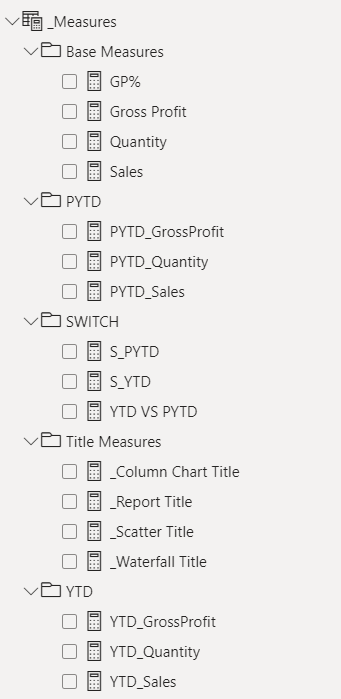

# Introduction
The aim of the project is to showcase the Power BI skills and bring to life a visual that highlights the performance of a fictitious company over the years.

1. The Data Used : [Excel](/Data/Plant_DTS.xls)

# Background
The data provided is of a fictitious company that sells it product globally. To assess the performance of the company on three parameters i.e. Sales, Quantity and Gross Profit over three years (2022,2023 & 2024) and comparing the year to date consumption with the previous years same record. Comparing these across different geographies over time and product lines will give a better understanding of the performance and help in identifying the areas to look into. Comapring each account in the scatter plot also helps in segmenting the most porfitable and valuable clients.

The key findings expected from the report are as follows:
1. Key performance metrics comparing Sales, Quantity and Gross Profit on the measures of current versus previous year.
2. The Gross Profit percentage for the company in a particular year.
3. Worst performing countries where the measures has declined from the previous year.
4. Distribution of YTD vs PYTD by month, country and product.
5. Segmenting accounts by profitability and order value.

# Tools Used

The following tools were used to do the necessary analysis:

- Power Bi: For analysis and creating the report.
- Visual Studio Code: For report creation.
- Git & GitHub: Essential for version control and sharing the power BI file, reports and analysis, ensuring storrage of all files ain one place.

### Limitation
Due to lack of license, we are unable to share the published file for public viewing.

# Data Preparation

## Loading the Data
The data is loaded in the Power BI and using Power query the table names are changed. The data is checked for any inconsistencies and once it is ascertained the data transofrmation is applied and now the data is ready to be used in the report generation.

## Creating Measures

Measures are created for each requirement and based on their usability they are grouped into folders for better readability.
    

   
  

    <ul>
    <li><strong>Base Measures</strong> contains all fundamental measures of quantity , sales, gross profit and gross profit percentage in total.</li>
    <li><strong>PYTD</strong> contains all the base measure calculations considering till the previous year.</li>
    <li><strong>YTD</strong> contains all the base measure calculations considering till the chosen year.</li>
    <li><strong>Title Measures</strong> contain dynamic names for all reports.</li>
    <li><strong>SWITCH</strong> contains the measuring metric for comparison.</li>
    </ul>
  

A Slicer is created in order to filter the reports as per the user requested inputs like "Sales", "Quantity" or "Gross Profit".

# Reports

Snapshot of the different pages of the reports are provided along with the user input.

1. 2023 and Gross Profit

2. 2023 and Quantity

3. 2023 and Sales

4. 2024 and Gross Profit

5. 2024 and Quantity

6. 2024 and Sales

7. Drill down feature is present which allows the user to dive deep into each level to find the root cause. The sequence of the drill down is marked by the arrow.

# Learnings
Key learnings in terms of technical ability:
1. DAX measures - Understanding the data and preparing measures are very essential for an insightful report generation.
2. Folders - Creating folders for measures improves the readability.
3. Visualisation - Understanding the capabilities and best use case of each visualisation is essential as this enhances the quality of the report.

# Inference

The following insights can be drawn from the dataset provided:
1. The profit percentage has marginally decreased in 2024 compared to 2023.
2. The account profitability segmentation has also got significantly impacted with the median profit percentage reducing to 37% (approx.) from around 40% in 2023.
3. The median sales value in 2024 has reduced by almost 10,000.
4. The median quanity has reduced by 500 units approximately.
5. The median gross profit of each account in 2024 has reduced by 4200 units from 2023.

| Y  | Base        | GP% | Value   |
|----|-------------|-----|---------|
| 23 | Sales       | 40% | 25-26K  |
| 24 | Sales       | 37% | 15-16K  |
| 23 | Quantity    | 40% | 1.1K    |
| 24 | Quantity    | 37% | 0.6K    |
| 23 | GrossProfit | 40% | 10.5K   |
| 24 | GrossProfit | 37% | 6.3K    |

# Conclusion
This project provides the performance report for Plant Co. for the year 2023 and 2024 (till April). Even though the trend shows there is deficit, it is indicative of the current state. Corrective measures can reverse the trend and improve the numbers for the rest of the year.

# Reference
The idea of the project is based on the work provided by Mr. Mo Chen. The work that has been refenced is provided [here](https://github.com/mochen862/power-bi-portfolio-project).  